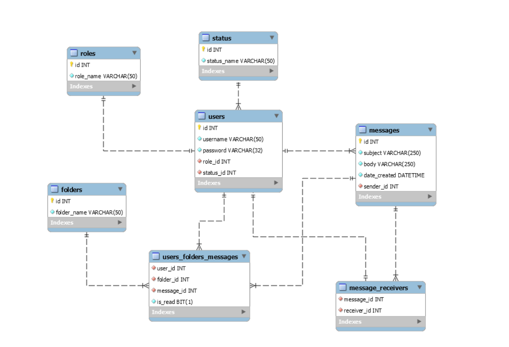

# jmess

A console messaging application, supporting different user roles and message folders (Inbox/Outbox/Trash)

## Built with

* [Java SE 1.8](https://www.oracle.com/technetwork/java/javase/downloads/jdk8-downloads-2133151.html) - The development environment used
* [MySQL Community Server 8.0](https://dev.mysql.com/downloads/mysql/) - The RDBMS used

## Application acceptances

* Only a user with the "Admin" role can create a user account providing respective username and password values
* A user can then login using given credentials and change his password
* Password fields are hashed with MD5
* No user is ever permanently deleted from the app/db. Only "deactivated"
* Only the "Deleter" role has the ability to permanently delete messages from the db

## Supported user roles

* __User__
  * Can send messages to any _other_ user in the system that is not deleted/deactivated
  * Messages can have multiple receivers
  * Has personal INBOX, SENTBOX, TRASH folders
  * Options to view/move/delete messages in his personal folders
* __Viewer__
  * All User Options
  * Can view all messages registered in the db, even if deleted by all participating users in their personal folders
* __Editor__
  * All User and Viewer Options
  * Ability to also edit any message. Changes are reflected in users’ personal folders
* __Deleter__
  * All User, Viewer and Editor Options
  * Ability to also delete any message. Message will be permanently deleted
* __Admin__
  * All User Options
  * Ability to create new accounts
  * Ability to manage user accounts, assign roles to users

## MySQL Schema

